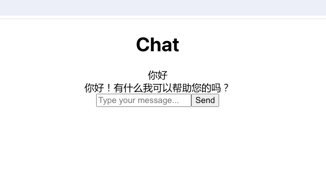

# auto-coder.example

This is an example project on how to use the auto-coder.

We will show you how to use the auto-coder to create a simple Chatbot based on Python + ReactJs + TypeScript + TailwindCSS.

## Install Auto-Coder

```bash
conda create -n auto-coder python=3.10.11
conda activate auto-coder
pip install auto-coder
ray start --head
```
Start some LLMs:

```bash
byzerllm deploy --pretrained_model_type saas/qianwen \
--cpus_per_worker 0.001 \
--gpus_per_worker 0 \
--num_workers 1 \
--infer_params saas.api_key=xxxxxx  saas.model=qwen-max \
--model qianwen_chat


byzerllm deploy --pretrained_model_type saas/qianwen_vl \
--cpus_per_worker 0.001 \
--gpus_per_worker 0 \
--num_workers 1 \
--infer_params saas.api_key=xxxxx  saas.model=qwen-vl-max \
--model qianwen_vl_chat
```

Please replace the api_key with your own api_key.

## How to reproduce this project

Try to get a copy of this project:

```bash
git clone https://github.com/allwefantasy/auto-coder.example.git auto-coder.example.copy
cd auot-coder.example.copy
```

Start the Chatbot:

Server:

```bash
python src/example/server/server.py
```

```bash
cd web
npm install
npm run start
```

Open the browser and visit http://localhost:3000

You will see a empty project, Now let's start to create a Chatbot.

## Create a Chatbot

Run the following command:

```bash
auto-coder --file actions/001_add_llm.yml
```

Then the auto-coder will ask you to input the result(we enable the human_as_model mode in the yml file),
Then you can copy the content of  actions/001_add_llm.output (which is generated by Calude Opus).

Finally type 'EOF' and click ENTER to finish the input.


repeat the above steps for the following files:

1. actions/002_add_page.yml
2. actions/003_remove_fastapi_cors.yml

After all the above steps, you  still need to modify the web/src/pages/Chat.tsx file:

```typescript
const response = await fetch('/llm/chat', {
```

to 

```typescript
const response = await fetch('http://127.0.0.1:9001/llm/chat', {
```

For now, you can visit http://localhost:3000 to see the Chatbot.




